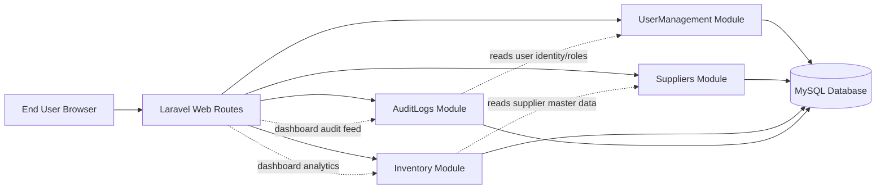
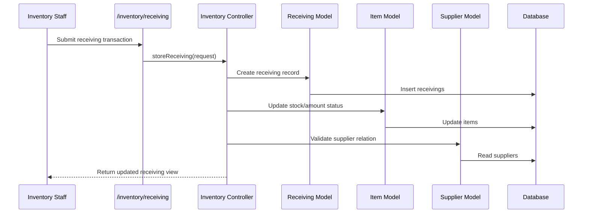
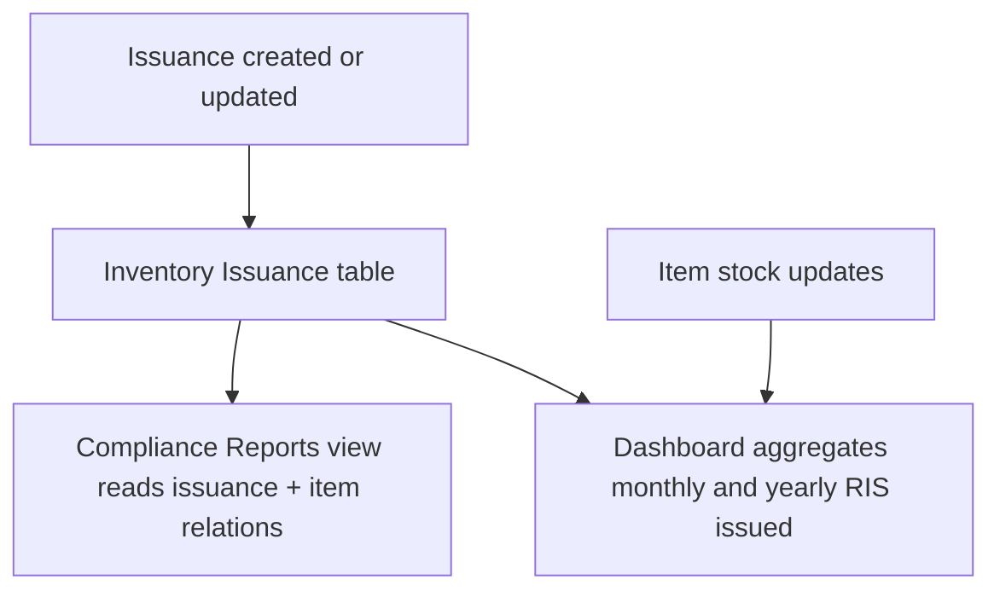
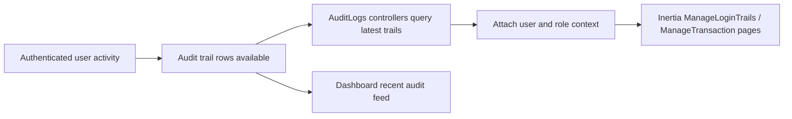

# NEMIX System Architecture Blueprint

## 1) Architecture Style

This project follows a modular monolith architecture using Laravel + Inertia + React, with business capabilities isolated under `Modules/` using nwidart/laravel-modules.

- Presentation layer: Web routes + Inertia pages
- Application layer: Module controllers
- Domain/data layer: Eloquent models per module
- Persistence layer: Shared MySQL database with module-owned tables

Enabled modules:

- UserManagement
- Inventory
- Suppliers
- AuditLogs

## 2) High-Level Blueprint (Component View)

## 3) Runtime Routing and Module Registration

- Global routes are mounted from `routes/web.php`.
- Each module registers routes via its own RouteServiceProvider.
- Inventory, Suppliers, AuditLogs, and UserManagement web routes are mounted into the web middleware group.
- Active modules are controlled by `modules_statuses.json` and loaded into front-end build inputs by `vite-module-loader.js`.

## 4) Module Responsibilities and Data Ownership

### UserManagement

Purpose:
- User CRUD endpoints scaffold
- Identity/roles source for audit attribution

Owned entities:
- Users/roles are primarily from core app auth + permission integration

### Suppliers

Purpose:
- Supplier master data lifecycle

Owned entities:
- Supplier (name, tin, address, reg_number, category, status)

Used by:
- Inventory receiving for supplier association

### Inventory

Purpose:
- Item catalog and stock state management
- Receiving and issuance transactions
- Category management
- Compliance and dashboard metrics support

Owned entities:
- Item
- Category
- Receiving
- Issuance

Cross-module dependencies:
- Receiving belongs to Supplier (Suppliers module)
- Issuance issuer belongs to User (core app)

### AuditLogs

Purpose:
- Login trail tracking
- Transaction trail visualization for operational traceability

Owned entities:
- LoginTrail
- TransactionTrail

Cross-module dependencies:
- TransactionTrail and LoginTrail resolve related user identity and roles

## 5) End-to-End Process Blueprints

### A) Receiving and Stock Impact (Inventory + Suppliers)

### B) Issuance and Compliance Reporting (Inventory + Dashboard)

### C) Audit Monitoring Flow (AuditLogs + UserManagement)

## 6) Integration Contracts Between Modules

- Inventory -> Suppliers:
	- Contract: `receivings.supplier_id` references Supplier
	- Benefit: Stable foreign key style association

- AuditLogs -> UserManagement/Core Auth:
	- Contract: `user_id` relation for attribution + role display
	- Benefit: Traceability of actions and login events

- Dashboard -> Inventory + AuditLogs:
	- Contract: Read-only analytics aggregation for KPIs and activity stream

## 7) Security and Access Pattern

- Module web endpoints are protected by `auth` and `verified` middleware for operational views.
- API routes are protected by `auth:sanctum`.
- Dashboard and compliance pages aggregate data only if module classes exist, reducing runtime hard failures when modules are toggled.

## 8) Recommended Future Hardening (Optional)

- Introduce service layer per module (Application services) to decouple controllers from direct model orchestration.
- Add domain events for receiving/issuance and consume them in AuditLogs for guaranteed activity capture.
- Introduce module-level API contracts (DTO/Resource classes) for clearer boundaries.

## 9) Quick Reference: Primary Process Ownership

- Supplier lifecycle: Suppliers module
- Inventory stock lifecycle: Inventory module
- Login and transaction traceability: AuditLogs module
- Identity and role context: UserManagement/core auth

