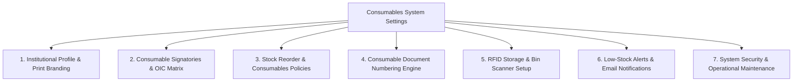

# NEMIX System Settings — Project Evaluation & Requirements Report
## Focused Exclusively on Consumables Inventory (Supplies & Materials)

> **Target System:** NEMIX (Supply and Inventory Management System - SIMS)  
> **Client / Organization:** Supply and Property Management Office (SPMO) — University of Camarines Norte (UCN)  
> **Operational Scope:** **Consumable Supplies & Materials Only** (Office supplies, janitorial, paper, ink/toners, chemicals, lab consumables).  
> **Excluded Scope:** Non-consumables, equipment, capital outlay/PPE, semi-expendable items, and non-expandable property (PAR, ICS, PO, and IAR are strictly excluded).  
> **Target Forms:** **RIS** (Requisition and Issue Slip), **RSMI** (Report of Supplies and Materials Issued), **RPCI** (Report on the Physical Count of Inventories), and **Stock Card**.  
> **Report Date:** September 7, 2026  
> **Author:** Antigravity Engineering & Architecture Review  

---

## Executive Summary

An architectural evaluation of the **NEMIX** project was conducted specifically for its primary operational domain: **Consumable Supplies and Materials Management** at the University of Camarines Norte SPMO.

Under Philippine Government Accounting Manual (GAM) guidelines for State Universities and Colleges (SUCs), consumable supplies follow a dedicated lifecycle governed by four core documents:
1. **Requisition and Issue Slip (RIS)** — Documenting end-user requests and official issuance of stock.
2. **Report of Supplies and Materials Issued (RSMI)** — Monthly consolidation of issued supplies submitted to Accounting.
3. **Report on the Physical Count of Inventories (RPCI)** — Periodic count of physical stock on hand vs. ledger balances.
4. **Stock Card** — Continuous ledger recording receipts, issuances, balances, and reorder levels per consumable item.

### Current Architectural Problem:
* **No Unified System Settings Engine:** Administrators currently cannot configure consumable reorder points, official signatories, institutional headers, document numbering sequences, or email alerts through the user interface.
* **Hardcoded Dependencies:** Accountable officer names (such as `ARSENIO GEM A. GARCILLANOSA` / `SUPPLY OFFICER III`), university metadata, and reorder thresholds (`stock <= 10`) are hardcoded directly inside PHP controllers, React views, and DTOs.
* **Lack of Consumables Policy Rules:** There is no setting to prevent negative inventory, manage consumable category thresholds, or automate RIS/RSMI reference sequence numbering.

This report establishes the refined technical and functional specification for a **System Settings Module** tailored strictly to **Consumable Supplies & Materials**.

---

## 1. Codebase Audit: Hardcoded Elements in Consumables Management

Our source-code inspection revealed hardcoded values that directly impact consumables operations:

### 1.1 Hardcoded Consumables Signatories
* **Requisition and Issue Slip (RIS):**
  * `resources/Official Forms/RequisitionIssueSlip.tsx` (lines 366, 391):
    `approved_by_name` defaults to `'ARSENIO GEM A. GARCILLANOSA'` and designation defaults to `'SUPPLY OFFICER III/ADMIN OFFICER V'`.
  * `resources/js/Pages/Inventory/Issuance.tsx` (lines 40, 314, 837, 1085, 1088):
    Hardcoded `setApprovedBy('ARSENIO GEM A. GARCILLANOSA')` on the client.
  * `Modules/Inventory/app/Http/Controllers/InventoryController.php` (lines 239, 286):
    Fallback in controller: `'approved_by' => $issuance->approved_by ?: 'ARSENIO GEM A. GARCILLANOSA'`.
* **Report of Supplies and Materials Issued (RSMI):**
  * In `ManageReports.tsx` (line 2154), the certification signatory falls back to `'ARSENIO GEM A. GARCILLANOSA'`.
* **Report on the Physical Count of Inventories (RPCI):**
  * `resources/Official Forms/RPCI Report.tsx` (lines 174, 178):
    `accountable_officer` defaults to `'Arsenio Gem A. Garcillanosa'` and designation defaults to `'Supply Custodian'`.
* **Stock Card:**
  * `resources/Official Forms/Stock Card Report.tsx` (line 148):
    Contains hardcoded regex replacements from Camarines Norte State College to University of Camarines Norte.
* **Impact:** Any changes in personnel, temporary assignments, or appointment of an **Officer-In-Charge (OIC)** currently require code changes and Docker container rebuilds.

### 1.2 Hardcoded Low-Stock Reorder Threshold
* In `Modules/Inventory/app/Http/Controllers/InventoryController.php` (`refreshItemTotals`, line 144):
  ```php
  $item->status = $item->stock <= 0 ? 'Out of Stock' : ($item->stock <= 10 ? 'Low Stock' : 'Available');
  ```
  * **Problem:** A fixed threshold of `10` is inadequate for consumables. For instance, `10` reams of paper in a large university represents critical low stock, while `10` printer drums or laser cartridges may represent an entire semester's supply.
  * Reorder thresholds must be dynamically configurable at the global level and per consumable category.

### 1.3 Client-Side Numbering Generators for Consumables
* In `Issuance.tsx` (line 54), RIS numbers are generated client-side:
  ```javascript
  return `${year}-${month}-${num}`;
  ```
* In `ManageReports.tsx` (lines 140-176), RSMI and RPCI report references rely on client-side regex parsing (`datePrefix-sequel`).
* **Impact:** Concurrent staff issuances can generate duplicate RIS numbers or out-of-order reference sequences. A server-side sequence engine with customizable prefixes (`RIS-`, `RSMI-`, `RPCI-`) and annual/monthly resets is required.

### 1.4 Hardcoded Email & Notification Limitations
* Low-stock warnings are only visual badges on the dashboard; there is no automated email notification to the Supply Officer when supplies hit the reorder point.
* SMTP configuration is trapped in `.env` without a visual testing interface.

---

## 2. Refined Specification: System Settings for Consumables

The System Settings module for NEMIX Consumables is structured into **7 dedicated functional sections**:



---

### Section 1: Institutional Profile & Print Branding
Controls the official institutional identity appearing on **RIS**, **RSMI**, **RPCI**, and **Stock Card** printouts.

| Setting Key | Type | Default Value | Usage on Consumable Documents |
| :--- | :--- | :--- | :--- |
| `institution_name` | String | `"University of Camarines Norte"` | Official header on RIS, RSMI, RPCI, Stock Card. |
| `institution_acronym` | String | `"UCN"` | Compact label on Stock Card bins and reports. |
| `custodial_office` | String | `"Supply & Property Management Office (SPMO)"` | Header sub-text on official supply forms. |
| `campus_address` | String | `"Daet, Camarines Norte"` | Printed on official inventory reports. |
| `responsibility_center_code` | String | `"01-101-00"` | Default Responsibility Center Code (RCC) for SPMO. |
| `institution_logo` | File/Image | `"/images/ucn-crest.png"` | Official university seal embedded on printable forms. |

---

### Section 2: Consumable Signatories & OIC Delegation Matrix
Replaces all hardcoded personal names on consumable forms with dynamic administrative settings.

#### 1. Requisition and Issue Slip (RIS) Signatories
* **Approving Authority:**
  * Official Name (e.g., `ARSENIO GEM A. GARCILLANOSA`)
  * Official Title (e.g., `Supply Officer III / Administrative Officer V`)
  * Division/Office (e.g., `SPMO`)
* **Issuing Officer (Custodian):**
  * Official Name (e.g., Supply Custodian / Storekeeper)
  * Official Title (e.g., `Administrative Aide VI / Storekeeper`)
* **Officer-In-Charge (OIC) Toggle:**
  * Checkbox: `Is Acting / OIC Active`
  * OIC Prefix text: `"OIC, "` or `"For and in the absence of the Supply Officer:"`
  * Effective Date Range: Auto-applies to RIS during leave or travel periods.

#### 2. Report of Supplies and Materials Issued (RSMI) Signatories
* **Certified Correct By:** Head of SPMO / Supply Custodian (Name & Position).
* **Posted By:** Accounting Officer / Inventory Bookkeeper (Name & Position).

#### 3. Report on the Physical Count of Inventories (RPCI) Signatories
* **Accountable Officer:** Name and official designation of the Supply Officer accountable for consumable balances.
* **Inventory Committee Chair & Members:** Names and titles of the physical inventory count committee.
* **COA Representative / Witness:** Name and office of the state auditor representative.

#### 4. Stock Card Signatories
* **Custodian In-Charge:** Name and station of the storekeeper managing the physical bin/card.

---

### Section 3: Stock Reorder & Consumables Policies
Controls inventory replenishment, threshold monitoring, and issuance rules for consumables.

#### 1. Reorder Point & Low-Stock Alerts
* **Global Low-Stock Threshold:** Configurable integer (default: `10` units).
* **Category-Specific Overrides:**
  * *Office Supplies (Paper/Pens):* e.g., `25` reams
  * *Janitorial & Sanitation (Alcohol/Disinfectants):* e.g., `15` gallons
  * *IT & Computer Consumables (Inks/Toners):* e.g., `5` cartridges
  * *Medical & First Aid Supplies:* e.g., `20` boxes
* **Critical Stock Threshold:** Configurable red-alert level (e.g., `3` units).

#### 2. Stock Integrity & Issuance Enforcement
* **Strict Balance Enforcement:** `[ON / OFF]`
  * When `ON`, the system strictly prevents issuing an item if quantity requested exceeds current physical stock on hand.
* **Auto-Deduct on Issuance:** `[ON / OFF]`
  * Automatically reduces Stock Card balance immediately upon RIS confirmation.

#### 3. Consumable Master Classifications
* **Units of Issue Master List:** Standardized consumable units:  
  `piece (pc)`, `box (bx)`, `ream (rm)`, `pack (pk)`, `roll (rl)`, `bottle (btl)`, `gallon (gal)`, `liter (ltr)`, `tube (tb)`, `pad (pd)`, `set (st)`.
* **Fund Clusters Master List:**  
  `01 - Regular Agency Fund`, `05 - Internally Generated Funds (IGF)`, `07 - Trust Receipts`, `08 - Revolving Fund`.

---

### Section 4: Consumable Document Numbering Engine
Replaces client-side string concats with reliable, server-managed atomic sequences.

```
Pattern: [PREFIX]-[YEAR]-[MONTH]-[SEQUENCE]
Example: RIS-2026-09-0042
```

| Document | Setting Prefix | Date Format | Sequence Length | Reset Frequency | Example Output |
| :--- | :--- | :--- | :--- | :--- | :--- |
| **Requisition & Issue Slip** | `RIS-` | `YYYY-MM-` | 4 digits (`0001`) | Resets every calendar year | `RIS-2026-09-0128` |
| **Report of Supplies Issued** | `RSMI-` | `YYYY-MM-` | 3 digits (`001`) | Resets every month | `RSMI-2026-09-003` |
| **Physical Count Report** | `RPCI-` | `YYYY-` | 3 digits (`001`) | Resets annually | `RPCI-2026-001` |
| **Stock Card Item Code** | `STOCK-` | None | 5 digits (`00001`) | Continuous sequential | `STOCK-00542` |

---

### Section 5: RFID Storage & Bin Scanner Setup
Tailored to consumable warehouse operations (shelf bins, supply racks, and bulk boxes).

1. **Warehouse Scanner Device Registry:**
   * Device ID (e.g., `READER_BIN_STATION_01`, `READER_DISPATCH_DESK`).
   * Location / Stockroom Area (e.g., Main SPMO Stockroom, Paper Storage Bay).
   * Status: `Active` / `Disabled`.
2. **Scanner Cooldown / Debounce Duration:**
   * Configurable debounce interval (e.g., `1200ms`) to prevent rapid repetitive reads when scanning consumable boxes or bin tags.
3. **Scanner Operational Mode:**
   * *Bin Tag Association Mode:* Associates an RFID tag with a consumable shelf/storage bin.
   * *Issuance Verification Mode:* Rapidly scans outgoing consumable packs against an approved RIS.
   * *RPCI Physical Count Mode:* Scans shelf tags during the annual physical count to auto-populate the RPCI worksheet.

---

### Section 6: Low-Stock Alerts & Email Notifications
Keeps the SPMO Supply Officer informed of inventory depletion.

1. **Automated Low-Stock Email Notifications:**
   * Toggle: `Enable Low Stock Email Alerts [ON / OFF]`.
   * Recipient Email List: Designated SPMO storekeepers and supply officers.
   * Alert Trigger: Dispatched immediately when a consumable item's balance falls below its reorder point after an issuance.
2. **Visual SMTP Configuration:**
   * Host, Port (587/465), TLS/SSL encryption, and credentials.
   * **"Send Test Email"** button directly in the browser to verify mail connectivity.

---

### Section 7: System Security & Operational Maintenance
1. **Inactivity Session Timeout:**
   * Configurable auto-logout for stockroom terminals (e.g., `15`, `30`, or `60` minutes).
2. **Operating Mode Controls (Maintenance & Staging):**
   * Mode switcher: `LIVE PRODUCTION`, `MAINTENANCE MODE`, `STAGING SANDBOX`, `TRAINING SIMULATION`.
   * Custom maintenance notice banner for non-admin staff.
3. **Database Backup & Consumables Log Retention:**
   * One-click manual database backup (`pg_dump`) to export all consumable stock, issuance, and audit records.
   * Audit log retention policy (archive/prune `login_trails` and `transaction_trails` older than 180 or 365 days).

---

## 3. Database Schema & Architecture Blueprint

### 3.1 Lightweight Settings Table
```sql
CREATE TABLE system_settings (
    id BIGSERIAL PRIMARY KEY,
    category VARCHAR(50) NOT NULL, -- 'institution', 'signatories', 'inventory', 'numbering', 'rfid', 'mail', 'security'
    key VARCHAR(100) NOT NULL UNIQUE,
    value JSONB NULL,
    data_type VARCHAR(20) NOT NULL DEFAULT 'string', -- 'string', 'integer', 'boolean', 'json'
    label VARCHAR(255) NOT NULL,
    description TEXT NULL,
    is_public BOOLEAN NOT NULL DEFAULT FALSE, -- Shared to frontend for RIS/RSMI rendering
    created_at TIMESTAMP NULL,
    updated_at TIMESTAMP NULL
);

CREATE INDEX idx_system_settings_category ON system_settings(category);
CREATE INDEX idx_system_settings_key ON system_settings(key);
```

### 3.2 Setting Service & Caching
* **Cache Key:** `nemix_consumable_settings` cached permanently in Redis/file cache.
* **Helper:** `Setting::get('inventory.low_stock_threshold', 10)` returns zero-query instant reads.
* **Cache Invalidation:** Flushed automatically when an administrator saves any change in System Settings.
* **Audit Trail:** Every change records a verified entry into `transaction_trails`.

### 3.3 Navigation Integration
* Location: [sidebarConfig.tsx](file:///c:/Users/Ramil/Downloads/NEMIX/resources/js/utils/sidebarConfig.tsx)
* Section: **Administration & Governance** $\rightarrow$ **System Settings**
* Access: Strict `System Admin` role check.

---

## 4. Summary: Direct Benefits for Consumables Management

| Operational Area | Before (Current State) | After (With Consumables System Settings) |
| :--- | :--- | :--- |
| **Signatories** | `ARSENIO GEM A. GARCILLANOSA` hardcoded in 18+ files. | Changed instantly via UI; supports Officer-In-Charge (OIC) dates for RIS/RSMI/RPCI. |
| **Low-Stock Alert** | Hardcoded at `<= 10` for all items in PHP. | Dynamic global reorder point + category overrides (e.g. 25 reams paper, 5 toners). |
| **Stock Issuance** | Client-side ID concat (`${year}-${month}-${num}`). | Server-generated atomic sequence (`RIS-2026-09-0042`) with annual reset. |
| **Notifications** | None. Manual monitoring of dashboard required. | Automated email alerts sent to Supply Officer when consumables reach reorder point. |
| **Forms Scope** | Cluttered with unused property/equipment forms. | Tightly focused on **RIS**, **RSMI**, **RPCI**, and **Stock Card**. |
| **Branding & Seal** | Static code imports. | Dynamic logo, agency code, and campus address rendered across all consumable reports. |
